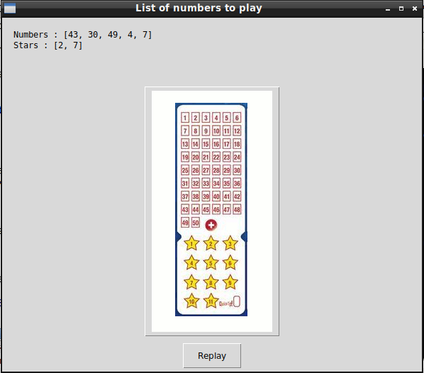

# EuroMillions-Lottery

## What's this game ?

EuroMillions-Lottery select randomly the numbers you can play for the Lottery.





## Rules of the game :

Like the real EuroMillions Lottery ticket this game select for you 5 numbers between 1 and 50 and 2 stars between 1 and 12.  
If you click the Replay button the game select again randomly the numbers for you.

## What you need to make it work :

This game is made for Python 3.  

Install all the packages for : Python 3.  

easygui at least version 0.98  

```sh
sudo python3 -m pip install --upgrade easygui  
```  

## Requirements :

If you miss a module, install it with the command pip install module-name. For example if you miss PIL you can install it with : sudo pip3 install pillow.


## How to launch the game :

```sh
python3 euroMillions.py
```


## Developer - Author

Hamdy Abou El Anein

